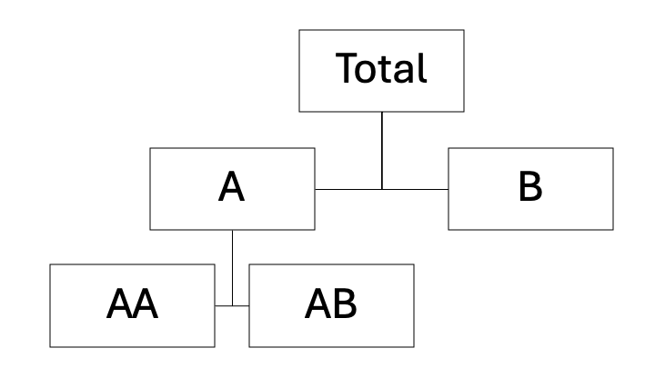
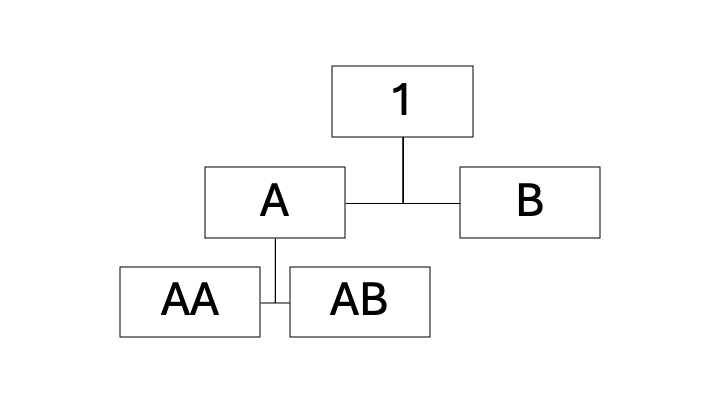
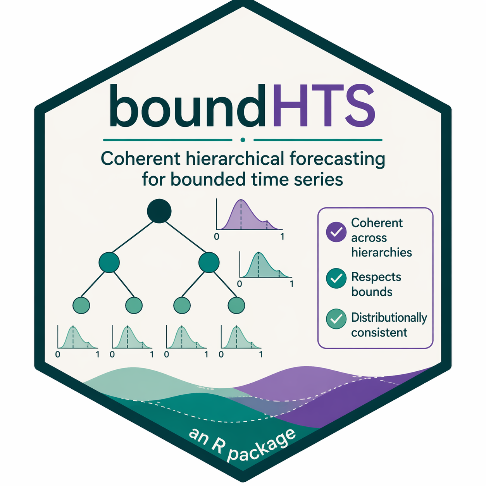
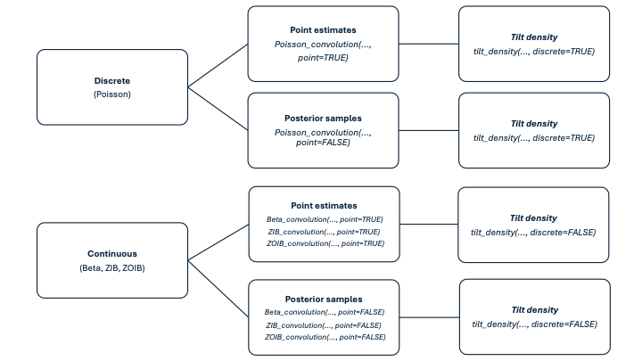
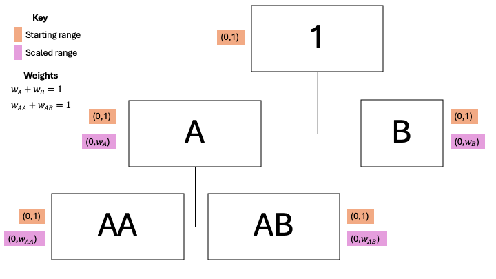

# Introduction

- Hierarchical time series are considered `coherent` when lower-level predictions aggregate exactly to higher levels, satisfying the system’s aggregation constraints. 

- Forecasts are often produced `independently` at each level, which can lead to `incoherence`.

- Forecast reconciliation provides a framework that adjusts these base forecasts to produce aggregate-consistent predictions.


```{r, echo=FALSE, out.width="50%", out.height="20%", fig.align="center"}

```


---

# Many, many R packages

- Several R packages on CRAN implement forecast reconciliation across a diverse range of scenarios, including:
    1. Point versus probabilistic forecasts ( `hts` vs. `ProbReco`)
    2. Discrete versus continuous data (`bayesRecon` vs. `fabletools`)
    3. Different hierarchical structures (e.g., temporal or cross-sectional). (`FoReco`)

- But, what about hierarchical forecasting under bounded constraints? 

```{r, echo=FALSE, out.width="50%", out.height="50%", fig.align="center"}

```


---

# Why do we do it?

- We present the `boundHTS` package which generates coherent hierarchical forecasts for bounded continuous and lower-bounded discrete variables 

- Our contribution lies in providing a method to obtain coherent and accurate forecast densities for both bounded and lower-bounded densities. 

- Crucially, the approach respects the natural bounds of parent distributions.

```{r, echo=FALSE, out.width="30%", out.height="25%", fig.align="center"}

```


---

# How do we do it?

- Let the bottom-level series in the hierarchical structure be mutually independent. 

- Under this assumption, we can combine the distributions of our bottom series via `convolution`.
    - It describes the probability distribution of the sum of two independent random variables (AA + AB = A).
    - Directly analogous to a bottom-up reconciliation strategy

- Bottom series observations are noisy and bias may be introduced if we just depend on them alone.
    - We `tilt` our convoluted density towards the predictive mean of the given aggregated series to reduce this bias.

- Together, convolutions and tilting allow us to add these forecasts together while respecting the constraints of the system. 


---

# Basic workflow of the R package

```{r, echo=FALSE, out.width="90%", out.height="80%", fig.align="center"}

```

---

# Lets do an example together

```{r, eval=FALSE}
install.packages("remotes")
remotes::install_github("hannahcomiskey/boundHTS")
```


---

# Extra details 

- We use weights to represent the contribution of each child node to their parent node and a four-parameter Beta distribution to rescale these Beta distributed random variables. 

```{r, echo=FALSE, out.width="70%", out.height="50%", fig.align="center"}

```
