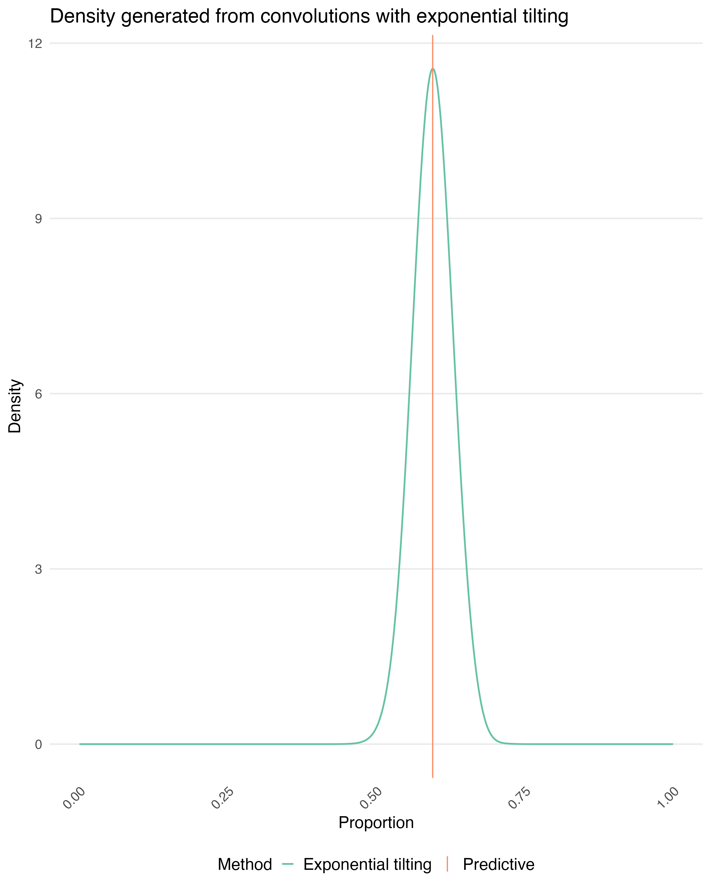
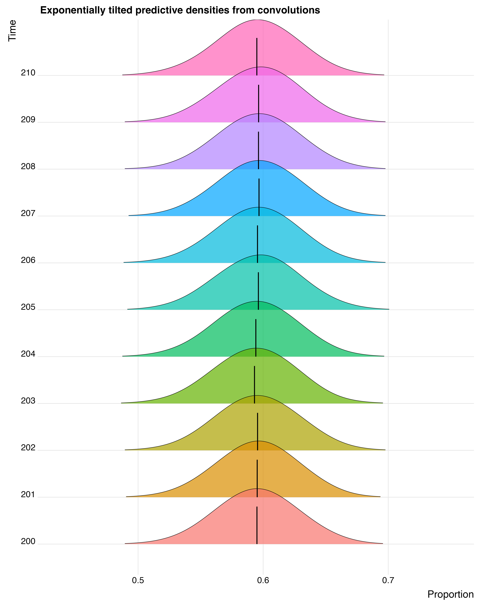

## Overview

```{r, setup, message = FALSE, warning = FALSE}

library(tidyverse)

set.seed(123)
n_obs   <- 400
burn_in <- 150
time    <- seq_len(n_obs)

inv_logit <- function(x) {
 p <- 1 / (1 + exp(-x))
 return(p)
}

inv_logit_delta <- function(mu, var) {
  prop_var <- (mu * (1 - mu))^2 * var
  return(prop_var)
} 

```


This vignette demonstrates how to:

1. Simulate correlated Beta-distributed time series at the bottom level of a hierarchy
2. Aggregate these series to higher levels with additional variability
3. Estimate Bayesian state–space models at each level using **JAGS**
4. Perform rolling one-step-ahead forecasting efficiently by reusing compiled models

The example is intentionally simple (two bottom-level series and one aggregate),but the workflow generalizes to larger hierarchies.

### Hierarchical structure

We consider a two-level hierarchy:

- **Bottom level**: two correlated proportions (`AA`, `AB`)
- **Top level**: their aggregate (`A`) and the complement (`B = 1 - A`) with noise.

All series take values in (0, 1) and are modelled using Beta distributions. Temporal dependence is introduced on the logit scale.


## Step 1: Load simulated Beta distributed data 

```{r}
head(beta_sim_data)

```


## Step 2: Generating model estimates

We estimate separate state–space models for:

- the **top-level series** (`A`)
- the **bottom-level series** (`AA`, `AB`)

We will use the logit-transformed proportions and an ARMA model to capture the temporal changes

### 2.1 Calculate logit of data

```{r}

logit_sim_data <- beta_sim_data %>% 
  mutate(logit_A = log(A/(1-A)),
         logit_AA = log(AA/(1-AA)),
         logit_AB = log(AB/(1-AB)))

```

### 2.2 Run the models

```{r}
forecasts_sims <- forecasts <- data.frame()
nsim <- 2000

# Top model
for(t in seq_along(n_testyears)) {
  
  # Calculate training data
  train_idx <- which(logit_sim_data$Time < n_testyears[t])
  training_data <- logit_sim_data[train_idx, , drop = FALSE]
  
  # Fit models
  mod_A_logit <- forecast::auto.arima(training_data$logit_A) 
  mod_AA_logit <- forecast::auto.arima(training_data$logit_AA) 
  mod_AB_logit <- forecast::auto.arima(training_data$logit_AB) 
  
  if(t==1) {
    pred_A <- tibble(logit_mean = mod_A_logit$fitted) %>% 
      mutate(Node = "A", Time = 1:length(mod_A_logit$fitted))
    pred_AA <- tibble(logit_mean = mod_AA_logit$fitted) %>% 
      mutate(Node = "AA", Time = 1:length(mod_AA_logit$fitted))
    pred_AB <- tibble(logit_mean = mod_AB_logit$fitted) %>% 
      mutate(Node = "AB", Time = 1:length(mod_AB_logit$fitted))
    
    training_mods <- list("A" = replicate(5000,
                                          simulate(mod_A_logit,
                                                   nsim = length(training_data$logit_A))),
                          "AA" = replicate(5000,
                                           simulate(mod_AA_logit,
                                                    nsim = length(training_data$logit_AA))), 
                          "AB" = replicate(5000,
                                           simulate(mod_AB_logit,
                                                    nsim = length(training_data$logit_AB))))
    
    forecasts <- bind_rows(forecasts, pred_A, pred_AA, pred_AB) # training data estimates
    
  }
  
  # Get one-step ahead predictions
  fc_A <- as_tibble(forecast::forecast(mod_A_logit, h = 1))
  fc_AA <- as_tibble(forecast::forecast(mod_AA_logit, h = 1))
  fc_AB <- as_tibble(forecast::forecast(mod_AB_logit, h = 1))
  
  # Get variance of one-step ahead forecast
  sim_logit_A <- replicate(5000, simulate(mod_A_logit, nsim = 1, future = TRUE))
  var_beta_A  <- var(sim_logit_A)
  sim_logit_AA <- replicate(5000, simulate(mod_AA_logit, nsim = 1, future = TRUE))
  var_beta_AA  <- var(sim_logit_AA)
  sim_logit_AB <-  replicate(5000, simulate(mod_AB_logit, nsim = 1, future = TRUE))
  var_beta_AB  <- var(sim_logit_AB)
  
  # Create results dataframes
  fc_A <- fc_A %>% mutate(Node = "A",
                          Time = n_testyears[t],
                          logit_var = var_beta_A) %>%
    rename(logit_mean = `Point Forecast`)
  fc_AA <- fc_AA %>% mutate(Node = "AA",
                            Time = n_testyears[t],
                            logit_var = var_beta_AA)  %>%
    rename(logit_mean = `Point Forecast`)
  fc_AB <- fc_AB %>% mutate(Node = "AB",
                            Time = n_testyears[t],
                            logit_var = var_beta_AB)  %>%
    rename(logit_mean = `Point Forecast`)
  
  forecasts <- bind_rows(forecasts, fc_A, fc_AA, fc_AB)
 
  # Create results dataframes
  sim_logit_A <- tibble(Node = "A",
                        Time = n_testyears[t],
                        logit_samp = sim_logit_A) 
  sim_logit_AA <- tibble(Node = "AA",
                        Time = n_testyears[t],
                        logit_samp = sim_logit_AA) 
  sim_logit_AB <- tibble(Node = "AB",
                        Time = n_testyears[t],
                        logit_samp = sim_logit_AB) 
  
  forecasts_sims <- bind_rows(forecasts_sims, sim_logit_A, sim_logit_AA, sim_logit_AB)
  
}

```


### 2.3 Back-transform the proportions
```{r}
# Back transform to proportions
prop_var <- inv_logit_delta(inv_logit(forecasts$logit_mean), forecasts$logit_var)

forecasts <- forecasts %>%
  mutate(proportion = inv_logit(forecasts$logit_mean),
         prop_var = prop_var) %>%
  select(Time, Node, logit_mean, logit_var, proportion, prop_var)

```


## Step 3: Coherent hierarchical forecasting

We estimate a coherent top-series probability density function (PDF) using a convolution and weighted Beta distributions. As inputs into this process we use:
- the **top-level series** (`A`) estimates
- the **bottom-level series** (`AA`, `AB`) estimates
- A fine grid over which the density exists
- Bottom-series weights

#### Step 4.1: Generate probability density function via convolution
We will generate PDFs for the withheld data points to validate our method. You can loop over all years of you wish by updating the code to do so.

```{r}
z_values <- seq(0, 1, length.out = 1000) # density grid
top_node <- "A"
bottom_nodes <- c("AA", "AB")
weights_bottom <- c(0.75, 0.25)

# Create results df
rec_df <- tibble()
n_sims <- 2000
n_draws <- 100
n_bottom <- 2

plan(future::multisession)   
options(future.seed=TRUE)

rec_list <- future.apply::future_lapply(seq_along(n_testyears), function(i) {
  
  t_i <- n_testyears[i]
  
  ## Get predictions
  P_top <- forecasts %>% 
    filter(Time == t_i, Node == top_node) %>% 
    pull(proportion)
  
  P_bottom <- forecasts %>% 
    filter(Time == t_i, Node %in% bottom_nodes) %>% 
    pull(proportion)
  
  ## Get variance
  var_top <- forecasts %>% 
    filter(Time == t_i, Node == top_node) %>% 
    pull(prop_var)
  
  var_bottom <- forecasts %>% 
    filter(Time == t_i, Node %in% bottom_nodes) %>% 
    pull(prop_var)
  
  ## Get Beta parameters
  top_params <- beta_params(P_top, sqrt(var_top))
  bottom_params <- list(
    beta_params(P_bottom[1], sqrt(var_bottom[1])),
    beta_params(P_bottom[2], sqrt(var_bottom[2]))
  )
  
  weighted_samps <- array(NA, dim = c(n_sims, n_draws, n_bottom))
  
  rec_local <- list()
  
  for (b in 1:n_bottom) {
    
    weighted_samps[, , b] <- matrix(
      ExtDist::rBeta_ab(
        n_sims * n_draws,
        bottom_params[[b]][1],
        bottom_params[[b]][2],
        0,
        weights_bottom[b]
      ),
      nrow = n_sims,
      ncol = n_draws
    ) # sample from reweighted bottom series
    
    dens <- dbeta(z_values,
                  bottom_params[[b]][1],
                  bottom_params[[b]][2]) # density of unweighted bottom series
    
    rec_local[[length(rec_local) + 1]] <-
      tibble(
        Node = bottom_nodes[b],
        Time = t_i,
        Z = z_values,
        Density = dens
      )
  }
  
  ## Convolution
  Density_top <- Beta_convolution_density_point_parallel(z_values = z_values,
                                                         alpha_point = bottom_params[[n_bottom]][1],
                                                         beta_point = bottom_params[[n_bottom]][2],
                                                         weighted_samps = weighted_samps,
                                                         weights = weights_bottom[n_bottom])
  
  rec_local[[length(rec_local) + 1]] <- tibble(Node = top_node,
                                               Time = t_i,
                                               Z = z_values,
                                               Density = Density_top)
  bind_rows(rec_local)
})

rec_df <- bind_rows(rec_list)


```

#### Step 4.2: Tilt the convoluted PDF towards the predictive mean

```{r}
for (t in seq_along(n_testyears)) {
  # Extract convolution densities for these nodes
  rec_dens_df <- rec_df %>%
    dplyr::filter(Time == n_testyears[t]) %>%
    tidyr::pivot_wider(names_from = Node, values_from = Density) %>%
    dplyr::select(Z, dplyr::all_of(tilted_nodes))

  # Predicted means
  mu_theory <- as.numeric(pred_ysim[t, tilted_nodes])

  # y grid
  y_vals <- sort(unique(rec_dens_df$Z))

  # Initialize results
  nu_star_vec <- numeric(length(tilted_nodes))
  tilted_samps <- matrix(NA, nrow = 5000, ncol = length(tilted_nodes))
  f_tilted <- matrix(NA, nrow = length(z_values), ncol = length(tilted_nodes))
  colnames(tilted_samps) <- colnames(f_tilted) <- tilted_nodes

  for (i in seq_along(tilted_nodes)) {
    name <- tilted_nodes[i]

    # Extract and normalise convolution base density
    f_y <- as.numeric(rec_dens_df[[name]])
    f_y <- f_y / pracma::trapz(y_vals, f_y)

    # Tilt density
    tilted_dens <- tilt_density(mu_theory[i], y_vals, f_y, discrete=FALSE) # tilt density
  
    nu_star_vec[i] <- tilted_dens$nu_star

    # Tilted density + samples
    f_tilted[, i] <- tilted_dens$f_tilted

    tilted_samps[, i] <- tilted_dens$tilted_samps

    cat("Tilted mean:", pracma::trapz(y_vals, y_vals * tilted_dens$f_tilted), "\n")
  }

  # Save per-t results
  nu_exp[[t]]      <- nu_star_vec
  exp_samps[[t]]   <- tilted_samps
  f_tilde_exp[[t]] <- f_tilted
}


```

#### Step 4.3: Visualise the tilted convoluted PDF and compare against the predictive mean

The figure presents the predictive density formed by convolving the estimated bottom-level weighted Beta distributions. The resulting density is subsequently tilted so that its expectation matches the corresponding one-step-ahead predictive mean, ensuring coherence between the full predictive distribution and the point forecast.

For a single time point:
```{r, echo=FALSE, out.width = "100%",  fig.align = "center"}
forecasts_mean <- pred_ysim %>%
  dplyr::mutate(Time_num = as.numeric(factor(Time)))

conv_dens <- rec_df %>%
    dplyr::filter(Time == 241) %>%
    tidyr::pivot_wider(names_from = Node, values_from = Density) %>%
    dplyr::select(Time, Z, dplyr::all_of(tilted_nodes)) %>%
  dplyr::mutate(Time_num = as.numeric(factor(Time)))

exp_plot_df <- dplyr::bind_rows(lapply(seq_along(f_tilde_exp), function(t) {
  tibble::tibble(
    x = z_values,
    Density = as.vector(f_tilde_exp[[t]]),
    Method = "Independent Exponential",
    Time = n_testyears[t])})) %>%
  dplyr::mutate(Density = ifelse(is.na(Density)==TRUE, 0, Density)) %>%
  dplyr::mutate(Time_num = as.numeric(factor(Time)))

ggplot2::ggplot(exp_plot_df %>% dplyr::filter(Time==241),
                ggplot2::aes(x = x, y = Time_num)) +
  ggridges::geom_density_ridges(ggplot2::aes(height = Density, fill = factor(Time)),
                                stat = "identity", scale = 1.2, alpha = 0.7,
                                colour = "black", linewidth = 0.3,
                                rel_min_height = 0.01) +
    ggridges::geom_density_ridges(data = conv_dens,
                                ggplot2::aes(x = Z, y = Time_num,  height = A),
                                stat = "identity", scale = 1.2, alpha = 0.7, 
                                colour = "black", linewidth = 0.3, 
                                rel_min_height = 0.01) +
  ggplot2::geom_segment(data = forecasts_mean %>% dplyr::filter(Time==241),
                        ggplot2::aes(x = A, xend = A, y = Time_num,
                                     yend = Time_num + 0.5, colour = "Predictive mean"),
                        linewidth = 0.8) +
  ggridges::theme_ridges(font_size = 18) +
  ggplot2::scale_colour_manual(name = "", values = c("Predictive mean" = "black")) +
  ggplot2::guides(fill = "none")+
  ggplot2::labs(x = "Proportion", y = "Time") +
  ggplot2::theme(legend.position = "bottom")
# ggsave(filename = paste0(vispath, "example_tilted_density_testset_A_arima_ridges.png"), width=12, height=15)



```

Across multiple time points:
```{r,  echo=FALSE, out.width = "100%",  fig.align = "center"}


```


